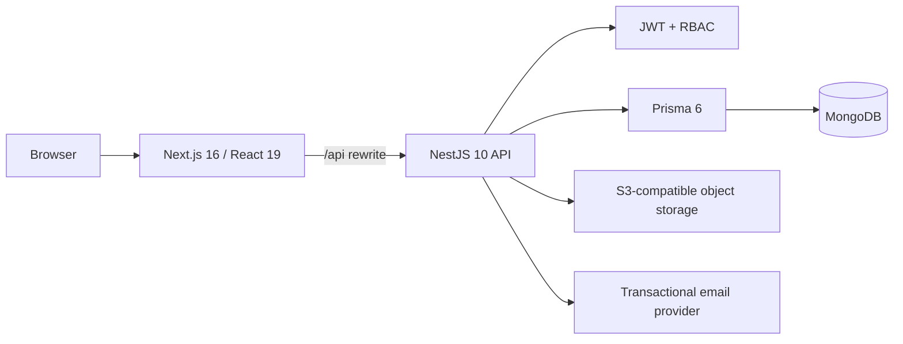

# Elite Drive

Elite Drive is a full-stack premium car-rental marketplace built around three real operating roles: renters, vehicle owners, and platform administrators.

**Production:** https://elite-drive-iota.vercel.app

The project is designed as an operational product rather than a static portfolio showcase. Public vehicle discovery, authenticated bookings, KYC, fleet management, availability, trip handover, reviews, promotions, disputes, wallet activity, settlement operations, and administrative review flows are connected to the application API.

> Payment processing is intentionally exposed as a sandbox workflow until a production payment provider and webhook verification layer are connected. The UI does not present the sandbox adapter as a live payment gateway.

## Product capabilities

| Area | Implemented workflow |
| --- | --- |
| Public marketplace | Live inventory, vehicle detail, availability, reviews, promotions |
| Authentication | Password login, email OTP login, renter/owner registration, password recovery |
| Renter | Search, booking creation, booking history, KYC, payment sandbox, promotions, reviews, profile, disputes/support |
| Vehicle owner | Dashboard, fleet CRUD, availability calendar, booking approval, trip pickup/return handover, wallet, profile, KYC |
| Administration | KYC review, vehicle approval, payment ledger, platform finance, settlements, withdrawals, disputes, promotions |
| Trust & safety | JWT authentication, role-based authorization, DTO validation, KYC review, vehicle verification, security headers |
| Delivery | GitHub Actions CI and Vercel production deployment from `main` |

## Architecture



The browser uses relative `/api/*` requests. Next.js proxies those requests to the backend configured through `BACKEND_URL`, keeping the backend origin out of browser-side application configuration.

More detail: [`docs/architecture.md`](docs/architecture.md)

## Technology stack

### Frontend

- Next.js 16.1
- React 19
- TypeScript
- Tailwind CSS
- Radix UI / shadcn-style components
- TanStack Query
- Axios
- React Hook Form + Zod
- Framer Motion
- Sonner
- Chart.js

### Backend

- NestJS 10
- TypeScript
- Prisma 6
- MongoDB
- Passport + JWT
- class-validator / class-transformer
- Swagger / OpenAPI
- bcrypt
- S3-compatible storage integrations
- Transactional email integrations

### Delivery and infrastructure

- GitHub Actions
- Vercel
- Docker Compose for local infrastructure
- Garage-compatible object storage configuration

## Repository structure

```text
.
├── .github/workflows/       # CI
├── client/                  # Next.js application
│   └── src/
│       ├── app/             # Public, renter, owner, and admin routes
│       ├── components/      # Shared UI
│       ├── features/        # Feature modules and API hooks
│       ├── hooks/           # Shared React hooks
│       ├── lib/             # Axios, auth, utilities
│       └── styles/          # Global styles
├── server/                  # NestJS API
│   ├── prisma/              # Prisma schema
│   └── src/
│       ├── common/          # Guards, decorators, response DTOs
│       ├── config/          # Runtime and Swagger configuration
│       ├── modules/         # Auth, customer, owner, admin, public, upload, mail
│       └── prisma/          # Prisma service
├── docker/                  # Local MongoDB / object-storage infrastructure
└── docs/                    # Architecture and release documentation
```

## Core user journeys

### Renter

1. Browse or filter the live fleet.
2. Review vehicle details and availability.
3. Sign in or register.
4. Complete identity verification when required.
5. Create a booking with pickup and return dates.
6. Track booking and trip status in the renter workspace.
7. Use the payment sandbox, promotions, reviews, and dispute workflows where applicable.

### Vehicle owner

1. Register or sign in as an owner.
2. Complete owner KYC and profile details.
3. Add vehicles to the fleet.
4. Maintain availability through the calendar.
5. Review and approve booking requests.
6. Execute pickup and return handover states.
7. Track wallet, income, and withdrawal activity.

### Administrator

1. Review renter/owner identity submissions.
2. Approve or reject vehicle listings.
3. Inspect payment and platform-wallet activity.
4. Release or refund eligible payments through settlement operations.
5. Review withdrawal requests.
6. Process and resolve disputes.
7. Create and manage marketplace promotions.

## Public API surface

The public module exposes product discovery endpoints such as:

```http
GET /api/cars
GET /api/cars/:car_id
GET /api/cars/:car_id/availability
GET /api/cars/:car_id/reviews
GET /api/reviews/summary
GET /api/promotions
```

Authenticated workflows are grouped under role-specific namespaces:

```text
/api/customer/*
/api/owner/*
/api/admin/*
```

Swagger documentation is served by the backend at `/docs` and the generated OpenAPI document is available at `/docs-json`.

## Local development

### Prerequisites

- Node.js 24 recommended
- npm
- MongoDB
- Docker / Docker Compose optional for local infrastructure

### 1. Clone

```bash
git clone https://github.com/phatnguyen03022001/elite-drive-demo-version.git
cd elite-drive-demo-version
```

### 2. Start the API

```bash
cd server
cp .env.example .env
npm ci
npx prisma generate
npm run start:dev
```

The API defaults to:

```text
http://localhost:8000
```

### 3. Start the web application

In another terminal:

```bash
cd client
cp .env.example .env.local
npm ci
npm run dev
```

The web application defaults to:

```text
http://localhost:3000
```

## Environment configuration

### Frontend

| Variable | Purpose | Local example |
| --- | --- | --- |
| `BACKEND_URL` | Server-side destination for the Next.js `/api/*` proxy | `http://localhost:8000` |
| `NEXT_PUBLIC_APP_URL` | Canonical frontend origin | `http://localhost:3000` |

### Backend

| Variable | Purpose |
| --- | --- |
| `NODE_ENV` | Runtime environment |
| `APP_PORT` | API listening port; defaults to `8000` |
| `FRONTEND_URL` | Additional allowed browser origin |
| `ALLOW_VERCEL_PREVIEWS` | Opt-in support for `*.vercel.app` preview origins |
| `DATABASE_URL` | MongoDB connection string used by Prisma |
| `JWT_SECRET` | JWT signing secret |
| `BCRYPT_ROUNDS` | Password hashing work factor |
| `BREVO_API_KEY` | Transactional email provider credential |
| `EMAIL_FROM` | Sender email |
| `EMAIL_FROM_NAME` | Sender display name |

Storage integrations require their own provider-specific variables. Never commit real credentials.

## Quality gates

Frontend:

```bash
cd client
npm run lint
npm run typecheck
npm run build
```

Backend:

```bash
cd server
npx prisma generate
npm run build
```

The repository CI runs frontend lint, type-check and build checks plus Prisma generation and backend compilation on changes targeting `main`.

## Production release flow

1. Update `main` with an atomic product or infrastructure change.
2. Let GitHub Actions validate frontend and backend builds.
3. Let Vercel create the production deployment from the same Git commit.
4. Verify the production deployment reaches `READY`.
5. Smoke-test the public marketplace, authentication entry points, and role-specific routes.
6. Inspect runtime errors before considering the release complete.

See [`docs/release-checklist.md`](docs/release-checklist.md).

## Security posture

- Private API routes use JWT authentication.
- Role guards separate renter, owner, and admin operations.
- NestJS validation pipes whitelist accepted DTO properties.
- Frontend responses include content-type, framing, referrer and permissions-policy headers.
- CORS is restricted to explicit origins; Vercel preview origins are opt-in.
- Runtime database and object-storage state are excluded from the repository.
- Garage credentials are injected through environment variables rather than committed configuration.
- Secrets that were ever committed must be rotated even after removal from the current Git tree.

See [`SECURITY.md`](SECURITY.md) for vulnerability reporting guidance.

## Engineering decisions

### API-backed public experience

The landing and fleet experiences use the same backend inventory exposed to authenticated workflows. This avoids a common portfolio failure mode where the marketing UI looks complete but is disconnected from the product data model.

### Explicit role boundaries

Renter, owner, and admin workflows are separated both in routing and authorization. Each workspace exposes only the controls relevant to that role.

### Honest payment boundary

The current payment workflow is a sandbox adapter used to exercise booking/payment/escrow state transitions. A production payment provider, signed webhook verification, idempotency strategy, and reconciliation process are intentionally treated as a separate integration milestone rather than represented as already complete.

### Environment-driven infrastructure

Backend URLs, database credentials, JWT secrets, email credentials, and object-storage credentials are runtime configuration. This keeps application source portable between local development, CI, preview, and production environments.

## Current product status

Elite Drive is a portfolio-grade full-stack marketplace with working product workflows across renter, owner, and admin roles. Remaining production-system work is primarily integration depth rather than placeholder UI: a real payment gateway, broader automated end-to-end coverage, production observability, and external service hardening.

## License

The repository is currently marked `UNLICENSED`. No reuse or redistribution rights are granted unless an explicit license is added.
