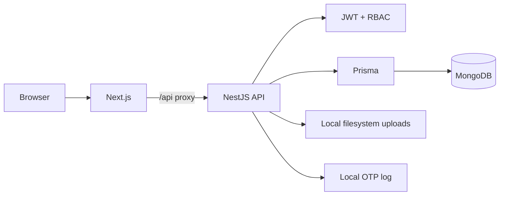

# Elite Drive

Elite Drive is a full-stack car-rental marketplace for renters, vehicle owners, and platform administrators.

The repository is designed so the application can be built, tested, and run locally without requiring a paid external service.

## Stack

### Frontend

- Next.js 16 / React 19
- TypeScript
- Tailwind CSS
- Radix UI
- TanStack Query
- React Hook Form + Zod

### Backend

- NestJS 10
- TypeScript
- Prisma 6
- MongoDB
- Passport + JWT
- class-validator / class-transformer

## Architecture



The browser uses relative `/api/*` requests. Next.js proxies them to the backend configured by `BACKEND_URL`.

Uploaded images are stored by the backend under `UPLOAD_DIR` and are served through `/api/upload/files/*`. OTP email delivery is represented locally through application logs, so development and CI do not depend on an email provider.

See [`docs/architecture.md`](docs/architecture.md) for more detail.

Operational documentation: [`docs/branch-workflow.md`](docs/branch-workflow.md) and [`docs/platform-runbook.md`](docs/platform-runbook.md). The concise release gate is [`docs/release-checklist.md`](docs/release-checklist.md).

## Product capabilities

- Public vehicle discovery and availability
- Password and OTP authentication
- Renter booking and trip workflows
- Owner fleet and availability management
- KYC review flows
- Reviews and promotions
- Payment sandbox and finance state transitions
- Admin review, settlement, withdrawal, and dispute operations

The payment provider integration is disabled by default. Local development uses the sandbox flow only when explicitly enabled.

## Repository structure

```text
.
├── .github/workflows/       # CI
├── client/                  # Next.js application
├── server/                  # NestJS API
│   ├── prisma/              # Prisma schema and data tooling
│   └── src/                 # Application source
├── docker/mongodb/          # Optional local MongoDB container
└── docs/                    # Architecture and release documentation
```

## Local development

### Requirements

- Node.js 24
- npm
- MongoDB, either installed locally or started with Docker

### Clone

```bash
git clone https://github.com/phatnguyen03022001/elite-drive.git
cd elite-drive
```

### Backend

```bash
cd server
cp .env.example .env
npm install
npx prisma generate
npm run start:dev
```

Default API URL:

```text
http://localhost:8000
```

### Frontend

```bash
cd client
cp .env.example .env.local
npm ci
npm run dev
```

Default web URL:

```text
http://localhost:3000
```

## Environment configuration

### Frontend

| Variable | Purpose | Default/local value |
| --- | --- | --- |
| `BACKEND_URL` | Server-side API destination | `http://localhost:8000` |
| `NEXT_PUBLIC_APP_URL` | Canonical frontend origin | `http://localhost:3000` |

### Backend

| Variable | Purpose |
| --- | --- |
| `NODE_ENV` | Runtime environment |
| `APP_PORT` | API port |
| `FRONTEND_URL` | Allowed browser origin |
| `DATABASE_URL` | MongoDB connection string |
| `JWT_SECRET` | JWT signing secret |
| `OTP_HASH_SECRET` | OTP hashing secret |
| `BCRYPT_ROUNDS` | Password hashing work factor |
| `UPLOAD_DIR` | Local upload directory |
| `UPLOAD_PUBLIC_BASE_URL` | Public upload route prefix |
| `MOCK_PAYMENTS_ENABLED` | Enables local payment sandbox outside production |
| `MOMO_ENABLED` | Optional payment adapter; disabled by default |

No Cloudinary, Brevo, Resend, AWS storage, or similar account is required to run the repository.

## Quality gates

Frontend:

```bash
cd client
npm run lint
npm run typecheck
npm run build
```

Backend:

```bash
cd server
npm install
npx prisma generate
npm run build
```

The backend build gate runs type checking, tests, dependency audit reporting, and compilation.

## CI

GitHub Actions runs on standard `ubuntu-latest` runners. The repository is public, so the standard runner path does not require private-repository Actions minutes. Documentation-only changes are ignored by CI.

Frontend uses the committed lockfile and `npm ci`. The backend currently installs from `server/package.json`; the previous backend lockfile was removed because it had drifted substantially from the manifest and contained obsolete dependencies.

## Security posture

- JWT authentication and role-based guards protect private routes.
- DTO validation whitelists accepted input properties.
- Cookie-authenticated mutations validate trusted origins.
- Uploaded images are size-, MIME-, and signature-validated.
- Upload paths are normalized before files are served.
- Secrets stay in runtime environment variables.
- External payment integration is disabled unless explicitly configured.

See [`SECURITY.md`](SECURITY.md).

## Engineering constraints

The default architecture follows these rules:

1. Build and test must not require a paid SaaS account.
2. Local development must work with MongoDB plus local filesystem storage.
3. External integrations must be explicitly enabled rather than silently required.
4. Documentation and environment examples must describe the current runtime, not historical infrastructure.

## License

The repository is currently `UNLICENSED`.
