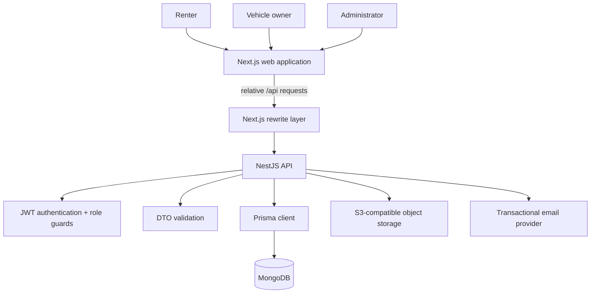
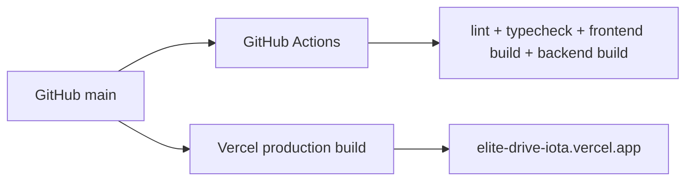

# Elite Drive Architecture

## System context

Elite Drive is a role-based car-rental marketplace with a Next.js web application and a NestJS API. The product separates renter, vehicle-owner, and administrator workflows while sharing one backend domain model.



## Frontend

The frontend uses the Next.js App Router. Public routes provide marketplace discovery and authentication entry points; authenticated workspaces are separated by role.

Primary route groups:

```text
/                       public marketplace
/login                  authentication
/register               authentication
/customer/*             renter workspace
/owner/*                vehicle-owner workspace
/admin/*                platform operations
```

Feature logic is organized under `client/src/features`, with TanStack Query used for server-state management and Axios for HTTP requests.

### API proxy

Browser code uses relative `/api/*` requests. `client/next.config.ts` rewrites those requests to:

```text
${BACKEND_URL}/api/*
```

This keeps the backend destination in server-side deployment configuration rather than requiring the application to expose an absolute backend origin to browser code.

## Backend

The NestJS application exposes public and role-protected REST modules.

Key domain modules include:

- authentication;
- public marketplace discovery;
- customer/renter operations;
- owner operations;
- administration;
- file uploads;
- transactional email.

Global `ValidationPipe` configuration enables transformation and property whitelisting at the API boundary.

### Authorization model

Private operations are protected with JWT authentication and role-aware guards. The application treats renter, owner, and administrator privileges as separate authorization boundaries rather than relying on UI visibility alone.

## Persistence

Prisma is the primary persistence access layer and targets MongoDB.

Important domain groups include:

- users and role-specific profile data;
- KYC submissions;
- cars, categories, locations, and availability;
- bookings and trips;
- reviews and promotions;
- payments, wallets, owner transactions, settlements, and withdrawals;
- disputes.

## Product workflows

### Vehicle discovery

Public inventory is filtered to approved and verified vehicles. The public API also exposes vehicle detail, availability, reviews, review summary, and active promotions.

### Booking lifecycle

A renter selects a car and dates, creates an authenticated booking, and follows booking/trip status through the customer workspace. Vehicle owners review incoming booking requests and handle trip pickup/return operations.

### Identity verification

Renters and owners submit KYC data and document images. Administrators review KYC submissions and approve or reject them. Uploaded files are stored through the backend upload abstraction.

### Vehicle review

Owners create and maintain fleet records. New vehicles enter a review state; administrators approve or reject them before they become publicly discoverable.

### Marketplace finance

The product includes payment records, a platform wallet/escrow model, owner wallet activity, settlements, refunds, and withdrawal review operations.

The current payment adapter is intentionally a sandbox implementation. It is sufficient for exercising state transitions but is not a production payment processor.

### Disputes

Renters can create support/dispute records. Administrators can move disputes into processing and resolve or close them with a recorded resolution.

## Security boundaries

### Browser to Next.js

Frontend responses include anti-sniffing, framing, referrer, and permissions-policy headers.

### Next.js to API

The API destination is configured by `BACKEND_URL`. CORS is restricted to explicit origins; Vercel preview origins are available only when explicitly enabled by environment configuration.

### API authorization

Authorization decisions belong in backend guards and service ownership checks. Client-side routing or hidden controls are not security controls.

### Secrets

JWT, database, email, and object-storage credentials belong in runtime environment configuration. Local Docker configuration must reference environment variables rather than embed reusable credentials.

## Deployment model



Each release should map a Git commit to both CI status and the Vercel deployment created from the same SHA.

## Known production boundaries

The following areas are intentionally treated as next-stage production integrations rather than represented as already solved:

- real payment-provider integration and signed webhooks;
- broader automated end-to-end coverage;
- centralized production observability and alerting;
- historical Git secret removal after credential rotation;
- tighter image-host allowlisting after storage domains are finalized.
