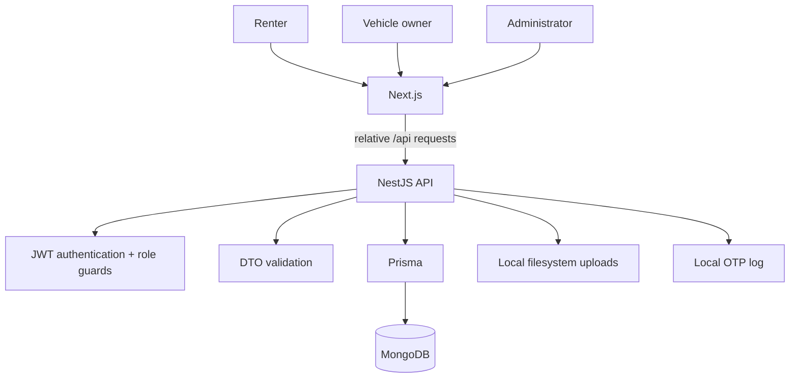

# Elite Drive Architecture

## System context

Elite Drive is a role-based car-rental marketplace with a Next.js frontend and a NestJS API.

The default architecture is local-first: build, test, and development do not require a paid SaaS account.



## Frontend

The frontend uses the Next.js App Router. Browser requests use relative `/api/*` paths. `client/next.config.ts` proxies them to `${BACKEND_URL}/api/*`.

Primary route groups:

```text
/                       public marketplace
/login                  authentication
/register               authentication
/customer/*             renter workspace
/owner/*                vehicle-owner workspace
/admin/*                platform operations
```

Server state is managed through TanStack Query. Forms use React Hook Form and Zod where appropriate.

## Backend

The NestJS API is organized around domain modules:

- authentication;
- public marketplace;
- customer/renter operations;
- vehicle-owner operations;
- administration;
- payments;
- uploads;
- local OTP delivery.

`ValidationPipe` provides transformation and property whitelisting at the API boundary.

### Authorization

Authorization is enforced by backend guards and ownership checks. UI visibility is not treated as a security boundary.

### Persistence

Prisma targets MongoDB. Core persistence areas include users, KYC, cars, availability, bookings, reviews, promotions, payments, wallets, settlements, withdrawals, and disputes.

## Upload storage

Uploads use the backend local filesystem adapter.

Configuration:

```text
UPLOAD_DIR=uploads
UPLOAD_PUBLIC_BASE_URL=/api/upload/files
```

The upload service:

- limits accepted image size;
- allowlists JPEG, PNG, and WebP;
- validates file signatures against MIME types;
- generates random filenames;
- normalizes public file paths before filesystem access.

No Cloudinary, S3, Garage, or MinIO service is required by the runtime.

## OTP delivery

OTP delivery is implemented as a local application-log transport. This keeps authentication flows testable without an external transactional-email account.

A future external mail adapter must remain optional and must not become a prerequisite for build, tests, or local development.

## Payments

The repository contains payment-domain state transitions and an optional provider adapter. External provider execution is disabled by default.

```text
MOCK_PAYMENTS_ENABLED=false
MOMO_ENABLED=false
```

Local development can exercise sandbox behavior only when it is explicitly enabled outside production.

## Security boundaries

### Browser to frontend

Frontend responses include content-type, framing, referrer, permissions-policy, and CSP headers.

### Frontend to API

`BACKEND_URL` controls the API destination. CORS remains restricted by backend origin configuration.

### API authorization

JWT authentication and role-aware guards protect private operations. Cookie-authenticated state-changing requests additionally validate trusted origins.

### Secrets

Database credentials and authentication secrets belong in runtime environment configuration. Real credentials must never be committed.

## CI

GitHub Actions validates `main` using standard `ubuntu-latest` runners.

Frontend gate:

```text
npm ci
lint
typecheck
build
```

Backend gate:

```text
npm install
prisma generate
typecheck
tests
production dependency audit report
build
```

Documentation-only changes are excluded from CI runs.

## Deployment independence

The repository does not require a specific hosting provider. A deployment target only needs to provide:

- Node.js runtime for the frontend/backend as applicable;
- MongoDB connectivity;
- writable storage if backend file uploads are enabled;
- required environment variables.

Hosting-provider configuration is operational metadata, not part of the application architecture.

## Engineering constraints

1. Local development must not require a paid external service.
2. CI must not invoke payment, email, or storage SaaS APIs.
3. External integrations must be explicitly enabled.
4. Documentation must match executable configuration.
5. Security controls remain enforced server-side.
